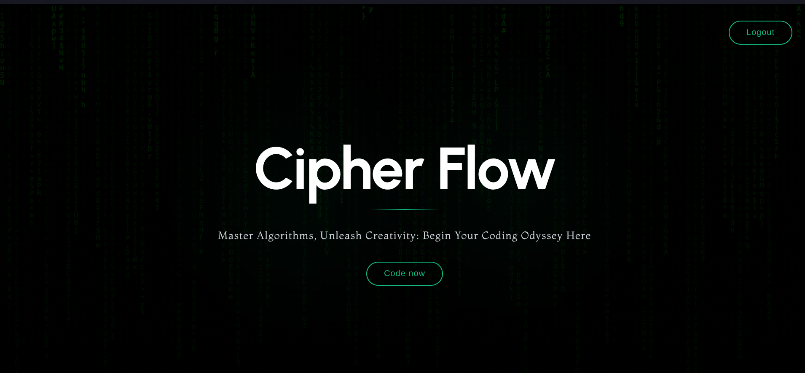
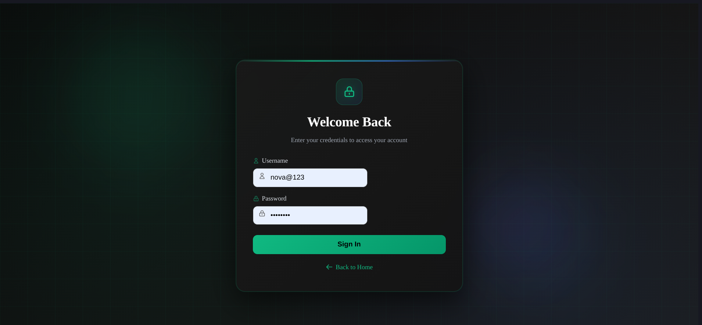
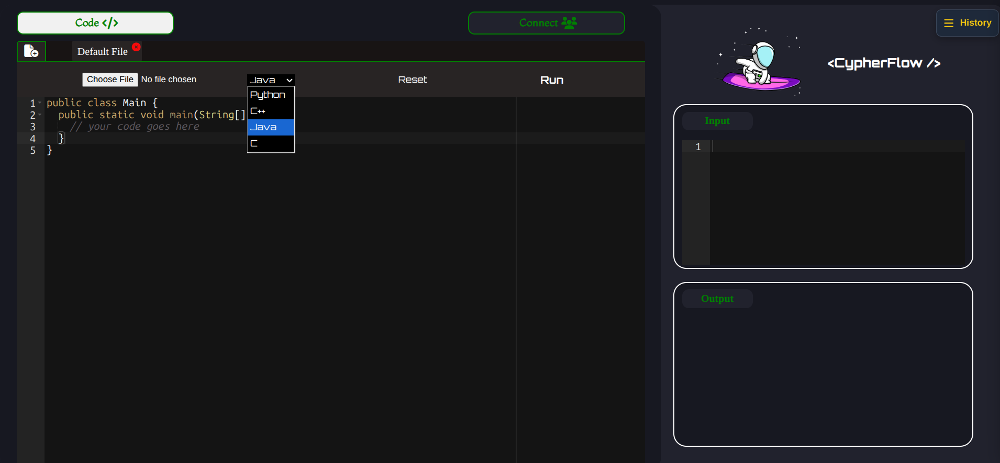
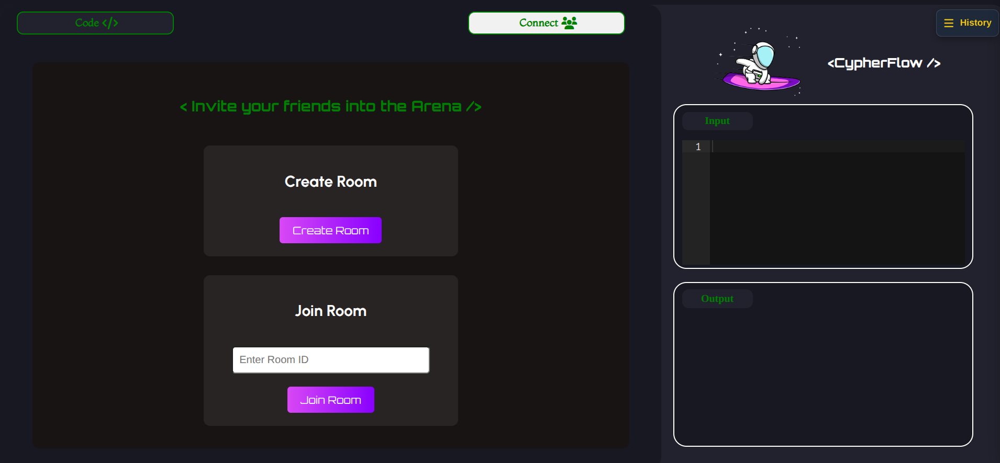
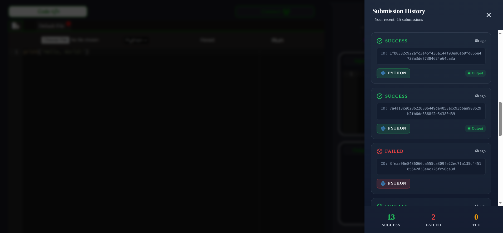
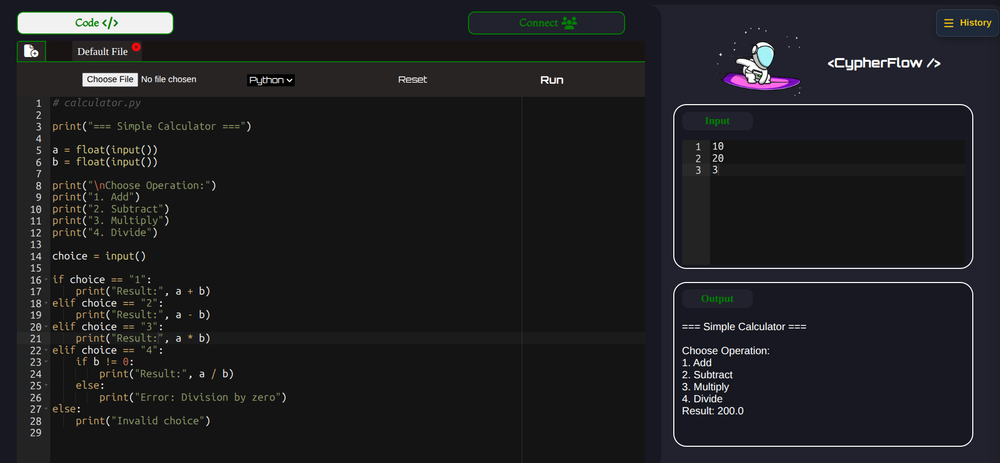

# 🚀 CypherFlow — Remote Code Execution & Collaborative Coding Platform

A scalable, secure, and high-performance online code execution and collaborative coding platform built using microservices and Docker-based sandboxing. Supports multi-language compilation, real-time collaboration, execution monitoring, and submission history with strict resource controls.

---

# ✨ Features

## 🔐 Secure Code Execution (Sandboxed Environment)

Each code submission is executed inside an isolated Docker container with:

- CPU limits
- Memory limits
- Timeouts
- Network isolation

This ensures user code cannot affect the host system.

> ✔ Prevents malicious access  
> ✔ Protects system resources  
> ✔ Enables safe multi-user execution

---

## 🌐 Multi-Language Support

Currently supports:

- Python
- C / C++
- Java

Each language is compiled and executed using optimized runtime containers.

---

## 🤝 Real-Time Collaborative Coding

Users can collaborate in real time using WebSockets:

- Live code syncing
- Multiple users in one room
- Instant updates
- Conflict-free editing

Powered by Socket.IO.

---

## 📊 Submission History & Tracking

Every submission is stored and tracked, with a submission ID generated on the client side as a hash of code and input, ensuring prevention of duplicate submissions:

- Execution status (Pending / Accepted / Failed)
- Output logs
- Error logs
- Language
- Timestamp

Users can view their recent submissions in a dedicated sidebar.

---

## 🔑 Authentication & Authorization

Uses JWT-based authentication:

- Secure login/signup
- Token-based session handling
- Protected API routes

---

## ⚡ Event-Based Execution Pipeline

Execution flow is asynchronous and event-driven:

- Requests are queued
- Workers execute jobs
- Results are published
- Clients receive updates

Ensures scalability and fault tolerance.

---

## 🧠 Intelligent Resource Management

Each execution container enforces:

- CPU quotas
- Memory caps
- OOM protection
- Timeout enforcement

This prevents abuse and infinite loops.

---

# 🖼 Screenshots

### Home Page

### Login Page

### Code Editor

### Collaborative Room

### Submission History

### Execution Output

---

# 🏗 Components and Tech-Stack

The platform follows a **microservices-based, event-driven architecture**.

### Main Components

#### 1️⃣ Frontend Client
- React-based SPA
- Ace Editor
- WebSocket client
- Auth handling

#### 2️⃣ API Gateway
- Handles requests
- Authentication
- Routing
- Validation

#### 3️⃣ Execution Service
- Runs Docker containers
- Enforces limits
- Compiles & executes code

#### 4️⃣ Socket Service
- Stores execution logs
- Publishes results
- Updates client
- Maintains collab-coding rooms

#### 5️⃣ Database
- Stores users
- Submissions
- Results

---

# ⚙️ Tech Stack

## Frontend
- React.js
- Ace Editor
- Socket.IO Client
- Styled Components

## Backend
- Node.js
- Express.js
- Socket.IO
- JWT
- Redis

## Execution Engine
- Go (Executor)
- Docker

## Database
- MongoDB

---
